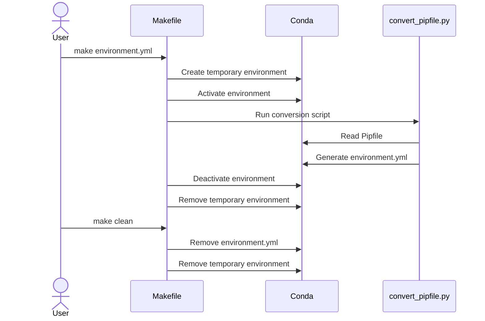

# Pipfile to Conda Environment Converter

When working with both pip and conda package managers, we need to:

1. Maintain Pipfile as single source of truth
2. Generate conda-compatible environment specifications
3. Avoid mixing pip and conda package installations
4. Ensure reproducible builds
5. Keep build environment separate from runtime environment

## Solution Components

### 1. convert_pipfile.py

The Python script that reads a Pipfile and generates an equivalent conda environment.yml. Key features:

- Uses toml to parse Pipfile
- Uses pyyaml to generate valid YAML output
- Automatically includes conda-forge channel
- Preserves Python version requirements
- Hardcodes environment name to 'ice_breaker'

### 2. convert_pipfile.yml

A minimal conda environment specification for running the converter:

```yaml
name: convert_pipfile
channels:
  - conda-forge
  - defaults
dependencies:
  - python=3.10
  - pyyaml
  - toml
```

### 3. Makefile

Orchestrates the conversion process:

- Creates temporary conda environment using convert_pipfile.yml
- Runs conversion
- Cleans up after itself

## How It Works

1. The Makefile creates a temporary conda environment using convert_pipfile.yml
2. It activates this environment and runs convert_pipfile.py
3. The script reads your Pipfile and generates an environment.yml
4. The temporary environment is removed

#### Sequence diagram for Pipfile to Conda environment conversion process



### File-Level Changes

| Change | Details | Files |
| ------ | ------- | ----- |
| Implementation of the Pipfile to conda environment converter script | <ul><li>Parses Pipfile using toml library</li><li>Generates conda environment structure with conda-forge and defaults channels</li><li>Preserves Python version requirements from Pipfile</li><li>Handles package version specifications</li><li>Supports fallback to pip packages when needed</li></ul> | `convert_pipfile.py` |
| Creation of build environment specification for the converter | <ul><li>Defines minimal conda environment with required dependencies</li><li>Specifies Python 3.10 as the base interpreter</li><li>Includes pyyaml and toml as dependencies</li></ul> | `convert_pipfile.yml` |
| Implementation of automated build process | <ul><li>Creates temporary conda environment for conversion</li><li>Manages environment activation and deactivation</li><li>Provides clean-up functionality</li><li>Ensures reproducible builds through make targets</li></ul> | `Makefile` |
| Documentation of the conversion process and usage | <ul><li>Explains solution components and their purposes</li><li>Details the conversion workflow</li><li>Provides usage instructions</li><li>Lists key requirements and constraints</li></ul> | `convert_pipfile.md` |
| Addition of example converted environment file | <ul><li>Demonstrates converted environment structure</li><li>Shows channel configuration</li><li>Lists converted package dependencies</li></ul> | `environment.yml` |

## Usage

To generate environment.yml:

```bash
make environment.yml
```

To clean up:

```bash
make clean
```
